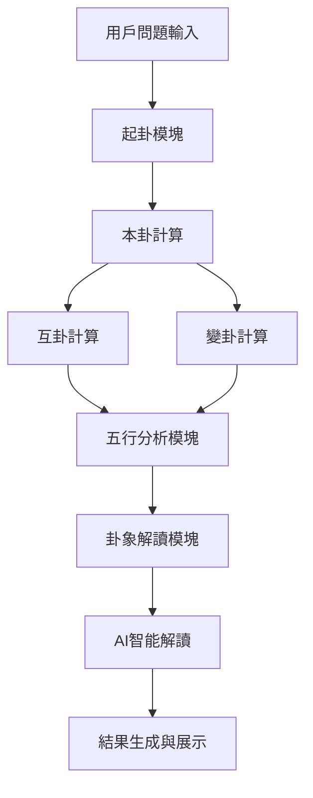
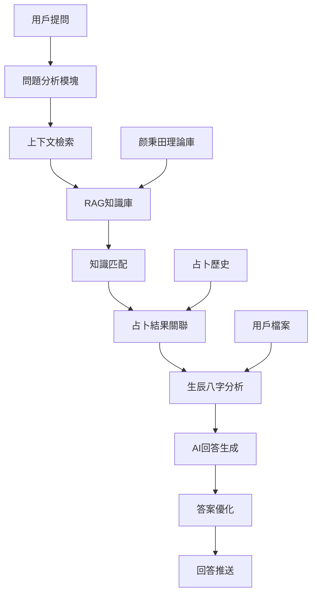
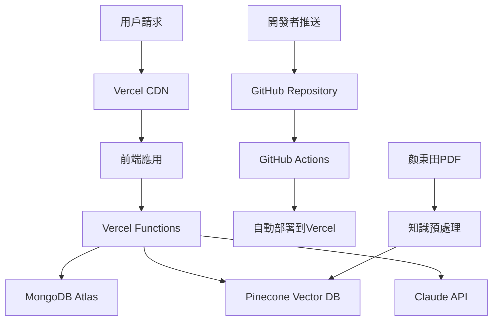

# 梅花心易占卜算法及占卜實現規劃及任務執行清單 v2.0

## 文檔信息
- **版本**：v2.0 (新增AI占卜顧問功能)
- **日期**：2025年1月26日  
- **作者**：梅花心易項目團隊
- **審核狀態**：優化版
- **適用範圍**：梅花心易占卜系統全棧開發
- **主要變更**：新增AI占卜顧問問答功能，優化技術棧配置

---

## 1. 項目概述與背景分析

### 1.1 項目現狀分析
基於對項目現有資料的深入分析，梅花心易項目具備以下基礎：

**已完成的工作**：
- ✅ 完整的產品需求文檔（PRD.md、PRD_MVP.md）
- ✅ 用戶流程設計和交互原型（12個完整頁面）
- ✅ 前端原型系統（Vue.js + 移動端優化）
- ✅ 基礎技術架構設計（Node.js + Express + MongoDB）
- ✅ 模擬占卜結果生成（僅供演示）

**核心缺失部分**：
- ❌ **專業的梅花易數算法實現**
- ❌ 真實的起卦邏輯和卦象計算
- ❌ AI智能解讀系統
- ❌ **AI占卜顧問問答功能** (新增)
- ❌ RAG知識庫構建 (新增)
- ❌ 後端API服務實現
- ❌ 數據庫設計和實現

### 1.2 項目目標與價值定位
**產品定位**：基於正宗梅花易數算法的AI智能占卜決策助手  
**核心價值**：專業算法 + AI解讀 + 移動優先 + 高性價比  
**目標用戶**：18-35歲年輕決策者，特別是一二線城市女性用戶

---

## 2. 梅花易數算法深度分析

### 2.1 傳統梅花易數核心理論

**歷史淵源**：
- 創立者：北宋易學家邵雍（邵康節）
- 理論基礎：先天八卦、五行生克、象數結合
- 特點：簡便易學、隨時起卦、準確率高

**算法核心原理**：
```
占卜流程 = 起卦 → 排卦 → 解卦 → AI增強解讀
         ↓      ↓      ↓         ↓
       數字轉換  卦象生成  五行分析   智能解讀
```

### 2.2 先天八卦數字對應關係
```javascript
const BAGUA_NUMBERS = {
  1: { name: '乾', symbol: '☰', element: '金', nature: '天' },
  2: { name: '兌', symbol: '☱', element: '金', nature: '澤' },
  3: { name: '離', symbol: '☲', element: '火', nature: '火' },
  4: { name: '震', symbol: '☳', element: '木', nature: '雷' },
  5: { name: '巽', symbol: '☴', element: '木', nature: '風' },
  6: { name: '坎', symbol: '☵', element: '水', nature: '水' },
  7: { name: '艮', symbol: '☶', element: '土', nature: '山' },
  8: { name: '坤', symbol: '☷', element: '土', nature: '地' }
};
```

### 2.3 起卦方法分類

**時間起卦法**（主要方法）：
```javascript
// 公式：(年支序數 + 月 + 日) % 8 = 上卦
// 公式：(年支序數 + 月 + 日 + 時辰) % 8 = 下卦
// 公式：(年支序數 + 月 + 日 + 時辰) % 6 = 動爻

function timeBasedDivination(year, month, day, hour) {
  const earthlyBranch = getEarthlyBranch(year);
  const baseNumber = earthlyBranch + month + day;
  
  const upperGua = (baseNumber % 8) || 8;
  const lowerGua = ((baseNumber + hour) % 8) || 8;
  const movingLine = ((baseNumber + hour) % 6) || 6;
  
  return { upperGua, lowerGua, movingLine };
}
```

**數字起卦法**（用戶輸入）：
```javascript
function numberBasedDivination(number1, number2) {
  const upperGua = (number1 % 8) || 8;
  const lowerGua = (number2 % 8) || 8;
  const movingLine = ((number1 + number2) % 6) || 6;
  
  return { upperGua, lowerGua, movingLine };
}
```

---

## 3. 核心算法架構設計

### 3.1 系統架構概覽



### 3.2 核心模塊設計

#### 3.2.1 起卦核心模塊（DivinationCore）
```javascript
class MeihuaDivinationCore {
  constructor() {
    this.baguaSystem = new BaguaSystem();
    this.fiveElements = new FiveElementsSystem();
    this.hexagramDatabase = new HexagramDatabase();
  }

  // 主要起卦方法
  async performDivination(question, method = 'time', params = {}) {
    // 1. 驗證輸入
    this.validateInput(question, method, params);
    
    // 2. 起卦計算
    const primaryResult = this.calculatePrimaryGua(method, params);
    
    // 3. 生成三卦
    const benGua = this.createHexagram(primaryResult.upperGua, primaryResult.lowerGua);
    const huGua = this.calculateHuGua(benGua);
    const bianGua = this.calculateBianGua(benGua, primaryResult.movingLine);
    
    // 4. 五行分析
    const wuxingAnalysis = this.analyzeFiveElements(benGua, huGua, bianGua);
    
    // 5. 基礎解讀
    const basicInterpretation = this.getBasicInterpretation(benGua, huGua, bianGua, wuxingAnalysis);
    
    return {
      question,
      timestamp: new Date(),
      benGua,      // 本卦
      huGua,       // 互卦  
      bianGua,     // 變卦
      movingLine: primaryResult.movingLine,
      wuxingAnalysis,
      basicInterpretation
    };
  }
}
```

#### 3.2.2 八卦系統模塊（BaguaSystem）
```javascript
class BaguaSystem {
  constructor() {
    this.initializeBaguaData();
  }

  // 獲取八卦屬性
  getBaguaProperties(number) {
    return {
      number: number,
      name: this.BAGUA_NAMES[number],
      symbol: this.BAGUA_SYMBOLS[number],
      element: this.BAGUA_ELEMENTS[number],
      nature: this.BAGUA_NATURES[number],
      direction: this.BAGUA_DIRECTIONS[number],
      attributes: this.BAGUA_ATTRIBUTES[number]
    };
  }

  // 創建六十四卦
  createHexagram(upperGua, lowerGua) {
    const hexagramNumber = this.getHexagramNumber(upperGua, lowerGua);
    return {
      id: hexagramNumber,
      name: this.getHexagramName(hexagramNumber),
      upperGua: this.getBaguaProperties(upperGua),
      lowerGua: this.getBaguaProperties(lowerGua),
      lines: this.generateHexagramLines(upperGua, lowerGua),
      traditional: this.getTraditionalMeaning(hexagramNumber)
    };
  }
}
```

#### 3.2.3 五行分析模塊（FiveElementsSystem）
```javascript
class FiveElementsSystem {
  constructor() {
    this.elements = ['金', '木', '水', '火', '土'];
    this.relations = this.initializeRelations();
  }

  // 分析五行關係
  analyzeFiveElements(benGua, huGua, bianGua) {
    const benElement = this.getHexagramElement(benGua);
    const huElement = this.getHexagramElement(huGua);
    const bianElement = this.getHexagramElement(bianGua);

    return {
      ben: benElement,
      hu: huElement,
      bian: bianElement,
      relationships: {
        benToHu: this.getRelationship(benElement, huElement),
        benToBian: this.getRelationship(benElement, bianElement),
        huToBian: this.getRelationship(huElement, bianElement)
      },
      fortune: this.calculateFortune(benElement, huElement, bianElement)
    };
  }

  // 五行生克關係判斷
  getRelationship(element1, element2) {
    if (this.relations.generation[element1] === element2) {
      return { type: 'generation', strength: 'strong', meaning: '生' };
    } else if (this.relations.destruction[element1] === element2) {
      return { type: 'destruction', strength: 'strong', meaning: '克' };
    } else if (element1 === element2) {
      return { type: 'same', strength: 'neutral', meaning: '同' };
    } else {
      return { type: 'neutral', strength: 'weak', meaning: '平' };
    }
  }
}
```

#### 3.2.4 卦象計算模塊
```javascript
class HexagramCalculation {
  // 計算互卦
  calculateHuGua(hexagram) {
    const lines = hexagram.lines;
    // 取2、3、4爻為上卦，3、4、5爻為下卦
    const upperLines = [lines[1], lines[2], lines[3]];
    const lowerLines = [lines[2], lines[3], lines[4]];
    
    const upperGua = this.linesToGua(upperLines);
    const lowerGua = this.linesToGua(lowerLines);
    
    return this.baguaSystem.createHexagram(upperGua, lowerGua);
  }

  // 計算變卦
  calculateBianGua(hexagram, movingLine) {
    const lines = [...hexagram.lines];
    // 動爻變化：陽變陰，陰變陽
    lines[movingLine - 1] = lines[movingLine - 1] === 1 ? 0 : 1;
    
    const upperLines = lines.slice(3, 6);
    const lowerLines = lines.slice(0, 3);
    
    const upperGua = this.linesToGua(upperLines);
    const lowerGua = this.linesToGua(lowerLines);
    
    return this.baguaSystem.createHexagram(upperGua, lowerGua);
  }
}
```

---

## 4. AI智能解讀系統設計

### 4.1 AI解讀架構
```javascript
class AIInterpretationSystem {
  constructor() {
    this.claudeAPI = new ClaudeAPI();
    this.promptTemplate = new PromptTemplateManager();
    this.contextAnalyzer = new ContextAnalyzer();
  }

  async generateInterpretation(divinationResult, userContext) {
    // 1. 分析用戶問題類型
    const questionType = this.contextAnalyzer.analyzeQuestionType(divinationResult.question);
    
    // 2. 構建提示詞模板
    const prompt = this.promptTemplate.buildPrompt({
      question: divinationResult.question,
      questionType: questionType,
      benGua: divinationResult.benGua,
      huGua: divinationResult.huGua,
      bianGua: divinationResult.bianGua,
      wuxingAnalysis: divinationResult.wuxingAnalysis,
      userProfile: userContext
    });

    // 3. 調用AI生成解讀
    const aiResponse = await this.claudeAPI.generateResponse(prompt);
    
    // 4. 後處理和格式化
    return this.formatInterpretation(aiResponse, divinationResult);
  }
}
```

### 4.2 提示詞模板設計
```javascript
const INTERPRETATION_PROMPT_TEMPLATE = `
你是一位精通梅花易數的專業占卜師，請基於以下卦象信息為用戶提供專業解讀：

**用戶問題**：{{question}}
**問題類型**：{{questionType}}

**卦象信息**：
- 本卦：{{benGua.name}}（{{benGua.upperGua.name}}{{benGua.lowerGua.name}}）
- 互卦：{{huGua.name}}（{{huGua.upperGua.name}}{{huGua.lowerGua.name}}）  
- 變卦：{{bianGua.name}}（{{bianGua.upperGua.name}}{{bianGua.lowerGua.name}}）
- 動爻：第{{movingLine}}爻

**五行分析**：
- 本卦五行：{{wuxingAnalysis.ben}}
- 互卦五行：{{wuxingAnalysis.hu}}
- 變卦五行：{{wuxingAnalysis.bian}}
- 五行關係：{{wuxingAnalysis.relationships}}

請提供：
1. 卦象總體含義（100-150字）
2. 針對具體問題的分析（150-200字）
3. 建議和指導（100字）
4. 時機把握（50字）

要求：語言親和、積極正面、具有指導意義，避免過於玄虛或消極。
`;
```

---

## 5. AI占卜顧問問答系統設計 (新增功能)

### 5.1 功能概述與價值
**功能描述**：基於用戶的占卜結果和生辰八字，提供智能對話式的占卜咨詢服務。用戶可以針對占卜結果提出具體問題，AI顧問將結合梅花心易理論和個人信息給出專業解答。

**核心價值**：
- **深度互動**：從單向解讀升級為雙向對話
- **個性化服務**：結合生辰八字的針對性建議  
- **專業指導**：基於颜秉田梅花心易理論的權威解答
- **用戶體驗提升**：增加產品粘性和使用深度

### 5.2 系統架構設計



### 5.3 核心模塊實現

#### 5.3.1 AI占卜顧問核心類
```javascript
class AIConsultantSystem {
  constructor() {
    this.pineconeClient = new PineconeClient();
    this.claudeAPI = new ClaudeAPI();
    this.contextManager = new ContextManager();
    this.userProfileAnalyzer = new UserProfileAnalyzer();
    this.knowledgeRetriever = new KnowledgeRetriever();
  }

  /**
   * 處理用戶問答請求
   * @param {string} question - 用戶問題
   * @param {string} divinationId - 相關占卜ID
   * @param {Object} userProfile - 用戶檔案（包含生辰八字）
   * @returns {Object} AI顧問回答
   */
  async answerQuestion(question, divinationId, userProfile) {
    try {
      // 1. 獲取占卜上下文
      const divinationContext = await this.getDivinationContext(divinationId);
      
      // 2. 分析用戶問題類型
      const questionAnalysis = this.analyzeQuestion(question);
      
      // 3. 檢索相關知識
      const relevantKnowledge = await this.retrieveRelevantKnowledge(
        question, 
        divinationContext,
        questionAnalysis.category
      );
      
      // 4. 分析生辰八字影響
      const bazi_analysis = this.userProfileAnalyzer.analyzeBaziInfluence(
        userProfile.birthInfo,
        divinationContext.hexagrams
      );
      
      // 5. 構建提示詞
      const prompt = this.buildConsultantPrompt({
        question,
        divinationContext,
        relevantKnowledge,
        userProfile,
        baziAnalysis: bazi_analysis,
        questionType: questionAnalysis.category
      });
      
      // 6. 生成AI回答
      const aiResponse = await this.claudeAPI.generateResponse(prompt);
      
      // 7. 後處理和優化
      const optimizedAnswer = this.optimizeAnswer(aiResponse, questionAnalysis);
      
      // 8. 保存對話記錄
      await this.saveConversation(divinationId, question, optimizedAnswer);
      
      return {
        answer: optimizedAnswer,
        relatedKnowledge: relevantKnowledge.sources,
        confidence: optimizedAnswer.confidence,
        followUpSuggestions: this.generateFollowUpSuggestions(questionAnalysis)
      };
      
    } catch (error) {
      throw new Error(`AI顧問回答生成失敗: ${error.message}`);
    }
  }
}
```

#### 5.3.2 RAG知識檢索系統
```javascript
class KnowledgeRetriever {
  constructor() {
    this.pinecone = new PineconeClient();
    this.embeddings = new OpenAIEmbeddings();
  }

  /**
   * 檢索相關知識
   * @param {string} query - 查詢問題
   * @param {Object} context - 占卜上下文
   * @param {string} category - 問題分類
   * @returns {Array} 相關知識條目
   */
  async retrieveRelevantKnowledge(query, context, category) {
    // 1. 生成查詢向量
    const queryEmbedding = await this.embeddings.embed(query);
    
    // 2. 構建查詢過濾器
    const filters = this.buildSearchFilters(context, category);
    
    // 3. 向量相似度搜索
    const searchResults = await this.pinecone.query({
      vector: queryEmbedding,
      filter: filters,
      topK: 10,
      includeMetadata: true
    });
    
    // 4. 結果排序和過濾
    const rankedResults = this.rankSearchResults(searchResults, context);
    
    return {
      knowledge: rankedResults.slice(0, 5),
      sources: rankedResults.map(r => r.metadata.source),
      confidence: rankedResults[0]?.score || 0
    };
  }

  buildSearchFilters(context, category) {
    return {
      category: { $in: [category, "general"] },
      hexagram_id: { $in: [
        context.hexagrams.ben.id,
        context.hexagrams.hu.id,
        context.hexagrams.bian.id
      ] },
      element: { $in: [
        context.analysis.wuxing.ben,
        context.analysis.wuxing.hu,
        context.analysis.wuxing.bian
      ] }
    };
  }
}
```

#### 5.3.3 生辰八字分析模塊
```javascript
class UserProfileAnalyzer {
  constructor() {
    this.baziCalculator = new BaziCalculator();
    this.elementAnalyzer = new FiveElementsAnalyzer();
  }

  /**
   * 分析生辰八字對占卜結果的影響
   * @param {Object} birthInfo - 出生信息
   * @param {Object} hexagrams - 卦象信息
   * @returns {Object} 八字分析結果
   */
  analyzeBaziInfluence(birthInfo, hexagrams) {
    // 1. 計算生辰八字
    const bazi = this.baziCalculator.calculate(birthInfo);
    
    // 2. 分析本命五行
    const nativeElements = this.elementAnalyzer.analyzeNativeFiveElements(bazi);
    
    // 3. 計算與卦象的五行相互關係
    const elementInteraction = this.analyzeElementInteraction(
      nativeElements,
      hexagrams
    );
    
    // 4. 分析時運影響
    const currentLuck = this.analyzeCurrentLuck(bazi, new Date());
    
    return {
      bazi: bazi,
      nativeElements: nativeElements,
      elementInteraction: elementInteraction,
      currentLuck: currentLuck,
      compatibilityScore: this.calculateCompatibility(nativeElements, hexagrams),
      recommendations: this.generateBaziRecommendations(elementInteraction, currentLuck)
    };
  }

  analyzeElementInteraction(nativeElements, hexagrams) {
    const interactions = {};
    
    ['ben', 'hu', 'bian'].forEach(type => {
      const hexagramElement = hexagrams[type].element;
      interactions[type] = {
        relationship: this.getElementRelationship(nativeElements.primary, hexagramElement),
        strength: this.calculateInteractionStrength(nativeElements, hexagramElement),
        influence: this.determineInfluence(nativeElements.primary, hexagramElement)
      };
    });
    
    return interactions;
  }
}
```

### 5.4 知識庫構建策略

#### 5.4.1 知識來源與分類
```javascript
const KNOWLEDGE_CATEGORIES = {
  THEORY: {
    name: "梅花心易理論",
    sources: ["颜秉田梅花心易-正式20231103v3.pdf"],
    subcategories: ["基礎理論", "卦象解讀", "五行生克", "時間應驗"]
  },
  HEXAGRAM: {
    name: "卦象解釋",
    sources: ["六十四卦詳解", "卦辭象辭"],
    subcategories: ["本卦含義", "變卦解讀", "互卦分析", "動爻解釋"]
  },
  BAZI: {
    name: "生辰八字",
    sources: ["八字命理學", "五行相配"],
    subcategories: ["四柱分析", "十神關係", "大運流年", "五行喜忌"]
  },
  APPLICATION: {
    name: "實際應用",
    sources: ["案例分析", "問題解答"],
    subcategories: ["感情婚姻", "事業財運", "健康疾病", "學業考試"]
  }
};
```

#### 5.4.2 知識向量化處理
```javascript
class KnowledgeIndexer {
  constructor() {
    this.pinecone = new PineconeClient();
    this.embeddings = new OpenAIEmbeddings();
  }

  /**
   * 處理颜秉田理論文檔
   * @param {string} pdfPath - PDF文件路徑
   */
  async processYanBingTianTheory(pdfPath) {
    // 1. PDF解析和文本提取
    const textChunks = await this.extractTextChunks(pdfPath);
    
    // 2. 智能分塊處理
    const processedChunks = await this.intelligentChunking(textChunks);
    
    // 3. 生成向量嵌入
    const embeddings = await this.generateEmbeddings(processedChunks);
    
    // 4. 存儲到Pinecone
    await this.storeInPinecone(embeddings, {
      source: "颜秉田梅花心易理論",
      category: "THEORY",
      priority: "high"
    });
  }

  async intelligentChunking(textChunks) {
    const chunks = [];
    
    for (const chunk of textChunks) {
      // 識別章節結構
      const sections = this.identifySections(chunk);
      
      // 按語義單元分塊
      const semanticChunks = await this.semanticChunking(sections);
      
      // 添加元數據
      chunks.push(...semanticChunks.map(sc => ({
        content: sc.text,
        metadata: {
          section: sc.section,
          keywords: this.extractKeywords(sc.text),
          hexagrams: this.identifyHexagrams(sc.text),
          elements: this.identifyElements(sc.text)
        }
      })));
    }
    
    return chunks;
  }
}
```

### 5.5 API接口設計

#### 5.5.1 顧問問答接口
```typescript
// POST /api/v1/consultant/ask
interface ConsultantRequest {
  question: string;                    // 用戶問題
  divinationId: string;               // 關聯的占卜ID
  conversationId?: string;            // 對話會話ID（可選）
  questionType?: string;              // 問題類型
  context?: {                         // 額外上下文
    focusArea?: string;               // 關注領域：感情/事業/健康等
    timeFrame?: string;               // 時間範圍：近期/長期
    specificConcern?: string;         // 具體關切點
  };
}

interface ConsultantResponse {
  success: boolean;
  data: {
    conversationId: string;           // 對話會話ID
    answer: {
      content: string;                // 回答內容
      confidence: number;             // 置信度 (0-1)
      reasoning: string;              // 推理過程
      keyPoints: string[];            // 關鍵要點
    };
    relatedKnowledge: {               // 相關知識來源
      sources: string[];              // 知識來源
      quotes: string[];               // 相關引用
    };
    baziInsights?: {                  // 八字洞察（如有）
      influence: string;              // 八字影響
      compatibility: number;          // 相容性評分
      recommendations: string[];      // 建議
    };
    followUp: {                       // 後續建議
      suggestedQuestions: string[];   // 建議追問
      relatedTopics: string[];        // 相關話題
    };
    metadata: {
      processingTime: number;         // 處理時間
      knowledgeCount: number;         // 使用知識條目數
      timestamp: string;              // 時間戳
    };
  };
  message?: string;
}
```

#### 5.5.2 對話歷史接口
```typescript
// GET /api/v1/consultant/conversations/:divinationId
interface ConversationHistory {
  divinationId: string;
  conversations: Array<{
    id: string;
    question: string;
    answer: string;
    timestamp: string;
    satisfaction?: number;            // 用戶滿意度評分
  }>;
  summary: {
    totalQuestions: number;
    averageSatisfaction: number;
    mainTopics: string[];
  };
}
```

### 5.6 用戶體驗設計

#### 5.6.1 對話界面設計
```javascript
// 前端對話組件設計
class ConsultantChat {
  constructor() {
    this.messageHistory = [];
    this.isTyping = false;
    this.currentDivination = null;
  }

  async sendQuestion(question) {
    // 1. 顯示用戶問題
    this.addMessage('user', question);
    
    // 2. 顯示AI思考狀態
    this.showTypingIndicator();
    
    // 3. 發送API請求
    const response = await this.consultantAPI.ask({
      question: question,
      divinationId: this.currentDivination.id,
      conversationId: this.conversationId
    });
    
    // 4. 隱藏思考狀態
    this.hideTypingIndicator();
    
    // 5. 逐字顯示AI回答
    await this.typewriterEffect(response.data.answer.content);
    
    // 6. 顯示相關建議
    this.showFollowUpSuggestions(response.data.followUp.suggestedQuestions);
  }

  async typewriterEffect(text) {
    const messageElement = this.addMessage('assistant', '');
    const words = text.split('');
    
    for (let i = 0; i < words.length; i++) {
      messageElement.textContent += words[i];
      await this.delay(30); // 30ms延遲
    }
  }
}
```

#### 5.6.2 智能問題建議
```javascript
class QuestionSuggestionEngine {
  constructor() {
    this.suggestionTemplates = this.loadSuggestionTemplates();
  }

  /**
   * 基於占卜結果生成建議問題
   * @param {Object} divinationResult - 占卜結果
   * @param {Object} userProfile - 用戶檔案
   * @returns {Array} 建議問題列表
   */
  generateSuggestions(divinationResult, userProfile) {
    const suggestions = [];
    
    // 1. 基於卦象特點的問題
    const hexagramSuggestions = this.getHexagramBasedSuggestions(
      divinationResult.hexagrams
    );
    
    // 2. 基於五行分析的問題
    const elementSuggestions = this.getElementBasedSuggestions(
      divinationResult.analysis.wuxing
    );
    
    // 3. 基於問題類型的深度問題
    const deepSuggestions = this.getDeepDiveSuggestions(
      divinationResult.question
    );
    
    // 4. 基於用戶歷史的個性化問題
    const personalizedSuggestions = this.getPersonalizedSuggestions(
      userProfile.questionHistory
    );
    
    return [
      ...hexagramSuggestions.slice(0, 2),
      ...elementSuggestions.slice(0, 2),
      ...deepSuggestions.slice(0, 1),
      ...personalizedSuggestions.slice(0, 1)
    ];
  }
}
```

---

## 6. 技術實現規劃 (更新技術棧)

### 6.1 技術棧優化與部署架構

#### 6.1.1 雲原生技術棧配置
基於需求二的技術棧要求，採用以下現代化雲原生架構：

**版本控制與協作**：
- **GitHub** - 代碼託管與版本管理 [[memory:1243638]]
- **GitHub Actions** - CI/CD自動化部署
- **GitHub Issues** - 需求管理與Bug追蹤

**前端部署**：
- **Vercel** - 無服務器前端部署平台 [[memory:1243638]]
- **自動部署** - Git推送觸發自動構建部署
- **CDN加速** - 全球內容分發網絡
- **域名管理** - 自定義域名配置

**後端服務**：
- **Vercel Serverless Functions** - 無服務器API端點
- **Edge Runtime** - 邊緣計算運行時
- **自動擴縮容** - 按需資源分配

**數據庫服務**：
- **MongoDB Atlas** - 雲原生NoSQL數據庫 [[memory:1243634]]
- **自動備份** - 數據安全保障
- **全球分布** - 就近數據存取
- **實時監控** - 性能指標追蹤

**RAG知識庫**：
- **Pinecone** - 向量數據庫服務
- **語義搜索** - 高精度知識檢索
- **實時索引** - 動態知識更新
- **多租戶架構** - 數據隔離

#### 6.1.2 部署架構圖


#### 6.1.3 環境配置管理
```javascript
// vercel.json 配置文件
{
  "functions": {
    "api/divination/perform.js": {
      "maxDuration": 30
    },
    "api/consultant/ask.js": {
      "maxDuration": 60
    }
  },
  "env": {
    "MONGODB_URI": "@mongodb_atlas_uri",
    "PINECONE_API_KEY": "@pinecone_api_key",
    "CLAUDE_API_KEY": "@claude_api_key"
  },
  "regions": ["hkg1", "tpe1"],
  "rewrites": [
    {
      "source": "/api/(.*)",
      "destination": "/api/$1"
    }
  ]
}
```

### 6.2 API接口設計 (更新)

#### 6.2.1 占卜核心接口
```typescript
// POST /api/v1/divination/perform
interface DivinationRequest {
  question: string;          // 占卜問題
  questionType?: string;     // 問題類型：感情/事業/學業/健康等
  method: 'time' | 'number'; // 起卦方法
  parameters?: {             // 起卦參數
    time?: {
      year: number;
      month: number; 
      day: number;
      hour: number;
    };
    numbers?: {
      number1: number;
      number2: number;
    };
  };
  userContext?: {            // 用戶背景信息
    gender?: string;
    age?: number;
    location?: string;
  };
}

interface DivinationResponse {
  success: boolean;
  data: {
    id: string;              // 占卜記錄ID
    question: string;
    timestamp: string;
    hexagrams: {
      ben: Hexagram;         // 本卦
      hu: Hexagram;          // 互卦
      bian: Hexagram;        // 變卦
    };
    movingLine: number;      // 動爻
    analysis: {
      wuxing: FiveElementAnalysis;
      traditional: string;   // 傳統解讀
      ai: string;           // AI智能解讀
    };
    advice: {
      timing: string;        // 時機建議
      action: string;        // 行動建議
      precaution: string;    // 注意事項
    };
  };
  message?: string;
}
```

#### 6.2.2 AI占卜顧問接口 (新增)
```typescript
// POST /api/v1/consultant/ask - AI顧問問答
// GET /api/v1/consultant/conversations/:divinationId - 對話歷史
// POST /api/v1/consultant/feedback - 顧問服務反饋
// GET /api/v1/consultant/suggestions/:divinationId - 智能問題建議
```

#### 6.2.3 輔助接口設計
```typescript
// GET /api/v1/hexagram/:id - 獲取卦象詳情
// GET /api/v1/divination/history - 獲取歷史記錄
// POST /api/v1/divination/feedback - 用戶反饋
// GET /api/v1/system/daily-fortune - 每日運勢
```

### 6.3 數據庫設計 (優化)

#### 6.3.1 核心數據模型 (MongoDB Atlas)
```javascript
// 占卜記錄表
const DivinationSchema = {
  _id: ObjectId,
  userId: ObjectId,
  question: String,
  questionType: String,
  method: String,
  parameters: Object,
  
  // 卦象信息
  hexagrams: {
    ben: {
      id: Number,
      name: String,
      upperGua: Object,
      lowerGua: Object,
      lines: Array
    },
    hu: Object,
    bian: Object
  },
  
  movingLine: Number,
  
  // 分析結果
  analysis: {
    wuxing: Object,
    traditional: String,
    ai: String,
    confidence: Number
  },
  
  // 元數據
  timestamp: Date,
  aiModel: String,
  processingTime: Number,
  userFeedback: {
    rating: Number,
    comment: String,
    helpful: Boolean
  },
  
  createdAt: Date,
  updatedAt: Date
};

// 卦象數據庫表
const HexagramSchema = {
  _id: Number,           // 1-64
  name: String,          // 卦名
  upperGua: Number,      // 上卦編號
  lowerGua: Number,      // 下卦編號
  
  traditional: {
    judgment: String,     // 卦辭
  commentary: String,   // 彖辭
    image: String,       // 象辭
    lines: Array         // 六爻爻辭
  },
  
  modern: {
    keywords: Array,     // 關鍵詞
    fortune: String,     // 吉凶
    advice: String,      // 建議
    timing: String       // 時機
  },
  
  wuxing: {
    primary: String,     // 主要五行
    secondary: String    // 次要五行
  }
};

// AI顧問對話記錄表 (新增)
const ConsultantConversationSchema = {
  _id: ObjectId,
  conversationId: String,      // 對話會話ID
  divinationId: ObjectId,      // 關聯占卜記錄
  userId: ObjectId,            // 用戶ID
  
  // 對話內容
  messages: [{
    id: String,
    type: String,              // 'user' | 'assistant'
    content: String,           // 消息內容
    timestamp: Date,
    metadata: {
      confidence: Number,      // AI回答置信度
      processingTime: Number,  // 處理時間
      knowledgeUsed: Array,    // 使用的知識條目ID
      reasoning: String        // 推理過程
    }
  }],
  
  // 對話統計
  stats: {
    totalMessages: Number,
    userSatisfaction: Number,  // 用戶滿意度評分
    averageResponseTime: Number,
    mainTopics: Array          // 主要討論話題
  },
  
  // 上下文信息
  context: {
    baziAnalysis: Object,      // 生辰八字分析結果
    userPreferences: Object,   // 用戶偏好
    sessionDuration: Number    // 會話持續時間
  },
  
  status: String,              // 'active' | 'closed' | 'archived'
  createdAt: Date,
  updatedAt: Date
};

// 用戶檔案擴展表 (新增)
const UserProfileExtendedSchema = {
  _id: ObjectId,
  userId: ObjectId,            // 關聯用戶ID
  
  // 生辰八字信息
  birthInfo: {
    year: Number,              // 出生年
    month: Number,             // 出生月
    day: Number,               // 出生日
    hour: Number,              // 出生時
    timezone: String,          // 時區
    location: {                // 出生地點
      city: String,
      province: String,
      country: String,
      coordinates: [Number]    // [經度, 緯度]
    }
  },
  
  // 八字分析結果緩存
  baziCache: {
    fourPillars: Object,       // 四柱八字
    fiveElements: Object,      // 五行分析
    tenGods: Object,           // 十神關係
    luckyElements: Array,      // 喜用神
    unluckyElements: Array,    // 忌神
    lastUpdated: Date
  },
  
  // 占卜偏好
  preferences: {
    questionTypes: Array,      // 常問問題類型
    consultantStyle: String,   // 偏好的顧問風格
    responseLength: String,    // 偏好回答長度：'brief' | 'detailed'
    focusAreas: Array         // 關注領域
  },
  
  // 使用統計
  usage: {
    totalDivinations: Number,
    totalConsultations: Number,
    averageSatisfaction: Number,
    favoriteFeatures: Array,
    lastActiveDate: Date
  },
  
  createdAt: Date,
  updatedAt: Date
};

// 知識庫索引表 (新增 - 配合Pinecone使用)
const KnowledgeIndexSchema = {
  _id: ObjectId,
  pineconeId: String,          // Pinecone向量ID
  
  // 知識內容
  content: {
    text: String,              // 原始文本
    summary: String,           // 內容摘要
    keywords: Array,           // 關鍵詞
    category: String,          // 分類
    subcategory: String        // 子分類
  },
  
  // 元數據
  metadata: {
    source: String,            // 來源：'颜秉田理論' | '卦象解釋' | '實用案例'
    chapter: String,           // 章節
    page: Number,              // 頁碼
    relevantHexagrams: Array,  // 相關卦象ID
    relevantElements: Array,   // 相關五行
    difficulty: String,        // 難度：'basic' | 'intermediate' | 'advanced'
    reliability: Number        // 可靠性評分 (0-1)
  },
  
  // 使用統計
  usage: {
    queryCount: Number,        // 查詢次數
    relevanceScore: Number,    // 平均相關性評分
    userFeedback: Number,      // 用戶反饋評分
    lastUsed: Date
  },
  
  // 向量信息
  vector: {
    dimensions: Number,        // 向量維度
    model: String,             // 嵌入模型
    createdAt: Date,
    lastUpdated: Date
  },
  
  status: String,              // 'active' | 'deprecated' | 'pending_review'
  createdAt: Date,
  updatedAt: Date
};
```

#### 6.3.2 Pinecone向量數據庫設計
```javascript
// Pinecone索引配置
const PineconeConfig = {
  indexName: "meihua-knowledge-base",
  dimension: 1536,             // OpenAI text-embedding-ada-002維度
  metric: "cosine",            // 相似度計算方法
  
  // 元數據篩選器
  metadataConfig: {
    indexed: [
      "category",
      "subcategory", 
      "source",
      "hexagram_id",
      "element",
      "difficulty",
      "relevance_score"
    ]
  },
  
  // 命名空間設計
  namespaces: {
    "theory": "理論知識",
    "hexagram": "卦象解釋", 
    "bazi": "八字命理",
    "application": "實際應用",
    "cases": "案例分析"
  }
};

// 向量查詢範例
const ExampleQuery = {
  vector: [/* 1536維向量 */],
  filter: {
    category: "theory",
    hexagram_id: { $in: [1, 2, 63] },
    element: { $in: ["火", "土"] },
    difficulty: { $ne: "advanced" }
  },
  topK: 10,
  includeMetadata: true,
  namespace: "theory"
};
```

### 6.4 技術棧選擇 (更新)

**雲原生全棧技術棧**：

**前端技術棧**：
- **框架**：Vue.js 3 + Vite（已實現原型系統）
- **部署**：Vercel前端託管
- **CDN**：Vercel Edge Network
- **域名**：自定義域名配置

**後端技術棧**：
- **運行時**：Vercel Serverless Functions
- **語言**：Node.js 18+
- **框架**：Express.js或Serverless函數
- **數據庫**：MongoDB Atlas（雲託管）
- **向量庫**：Pinecone（RAG知識庫）
- **AI服務**：Claude 3.7 Sonnet API

**DevOps工具鏈**：
- **版本控制**：GitHub
- **CI/CD**：GitHub Actions + Vercel自動部署
- **監控**：Vercel Analytics + MongoDB Atlas監控
- **日誌**：Vercel Function Logs

**關鍵依賴包更新**：
```json
{
  "dependencies": {
    "@vercel/node": "^2.15.0",
    "mongoose": "^7.0.0",
    "@pinecone-database/pinecone": "^1.1.0",
    "openai": "^4.0.0",
    "anthropic": "^0.17.0",
    "axios": "^1.3.0",
    "joi": "^17.8.0",
    "pdf-parse": "^1.1.1",
    "langchain": "^0.1.0"
  },
  "devDependencies": {
    "@vercel/cli": "^32.0.0",
    "jest": "^29.4.0"
  }
}
```

---

## 7. 開發任務執行清單 (更新版本)

### 7.1 開發階段劃分 (新增AI顧問功能)

**Phase 1: 核心算法實現（預計15-20天）**
- [ ] 梅花易數核心算法開發
- [ ] 八卦系統實現
- [ ] 五行分析模塊
- [ ] 生辰八字計算模塊 (新增)
- [ ] 單元測試覆蓋

**Phase 2: RAG知識庫建設（預計12-15天）** (新增Phase)
- [ ] 颜秉田理論文檔處理
- [ ] Pinecone向量數據庫配置
- [ ] 知識分塊與向量化
- [ ] 知識檢索系統實現
- [ ] 知識庫質量驗證

**Phase 3: API服務開發（預計12-15天）** 
- [ ] Vercel Serverless函數搭建
- [ ] 占卜接口實現
- [ ] AI顧問問答接口 (新增)
- [ ] MongoDB Atlas數據庫設計
- [ ] 接口測試

**Phase 4: AI智能解讀與顧問（預計15-18天）** (擴展)
- [ ] AI基礎解讀系統
- [ ] AI顧問對話系統 (新增)
- [ ] 上下文管理模塊 (新增)
- [ ] 生辰八字關聯分析 (新增)
- [ ] Claude API集成優化
- [ ] 問題建議引擎 (新增)
- [ ] 對話體驗優化 (新增)

**Phase 5: 系統集成與部署（預計10-12天）** (更新)
- [ ] 前後端集成
- [ ] Vercel自動部署配置
- [ ] GitHub Actions CI/CD
- [ ] 性能優化
- [ ] 錯誤處理完善
- [ ] 系統測試

### 7.2 詳細任務分解 (新增AI顧問功能)

#### 7.2.1 Phase 1: 核心算法實現 (擴展)

**Task 1.1: 梅花易數核心算法（5-7天）**
- [ ] **1.1.1** 起卦邏輯實現
  - 時間起卦法 `timeBasedDivination()`
  - 數字起卦法 `numberBasedDivination()` 
  - 輸入驗證和容錯處理
  - 預計工時：2天

- [ ] **1.1.2** 卦象計算實現
  - 本卦生成 `createHexagram()`
  - 互卦計算 `calculateHuGua()`
  - 變卦計算 `calculateBianGua()`
  - 預計工時：2天

- [ ] **1.1.3** 卦象數據庫構建
  - 64卦完整數據整理
  - 傳統卦辭、象辭錄入
  - 現代解讀模板建立
  - 預計工時：2-3天

**Task 1.2: 八卦系統實現（3-4天）**
- [ ] **1.2.1** 先天八卦數據結構
  - 八卦屬性定義
  - 五行對應關係
  - 方位、象意數據
  - 預計工時：1天

- [ ] **1.2.2** 八卦操作方法
  - 數字轉八卦 `numberToGua()`
  - 八卦組合卦象 `createHexagram()`
  - 卦象查詢方法
  - 預計工時：2天

- [ ] **1.2.3** 卦象屬性計算
  - 卦象五行計算
  - 吉凶趨勢判斷
  - 卦象關係分析
  - 預計工時：1天

**Task 1.3: 五行分析模塊（4-5天）**
- [ ] **1.3.1** 五行基礎系統
  - 五行生克關係定義
  - 五行強弱計算
  - 五行平衡分析
  - 預計工時：2天

- [ ] **1.3.2** 卦象五行分析
  - 三卦五行提取
  - 五行關係計算
  - 吉凶判斷邏輯
  - 預計工時：2天

- [ ] **1.3.3** 運勢趨勢計算
  - 本卦→互卦→變卦趨勢
  - 時機判斷算法
  - 建議生成邏輯
  - 預計工時：1天

**Task 1.4: 生辰八字計算模塊（4-5天）** (新增)
- [ ] **1.4.1** 八字基礎計算
  - 年月日時柱計算
  - 天干地支推算
  - 時區處理邏輯
  - 預計工時：2天

- [ ] **1.4.2** 五行分析擴展
  - 四柱五行分析
  - 十神關係計算
  - 五行強弱判斷
  - 預計工時：2天

- [ ] **1.4.3** 八字與卦象關聯
  - 命理五行與卦象五行對比
  - 相容性評分算法
  - 影響力權重計算
  - 預計工時：1天

**Task 1.5: 單元測試（3-4天）** (更新)
- [ ] **1.5.1** 算法測試用例
  - 起卦方法測試
  - 卦象計算驗證
  - 八字計算測試 (新增)
  - 邊界條件測試
  - 預計工時：2天

- [ ] **1.5.2** 數據驗證測試
  - 八卦數據完整性
  - 五行關係正確性
  - 八字計算準確性 (新增)
  - 卦象屬性準確性
  - 預計工時：1天

- [ ] **1.5.3** 性能測試
  - 算法執行效率
  - 內存使用測試
  - 並發處理能力
  - 預計工時：1天

#### 7.2.2 Phase 2: RAG知識庫建設 (新增階段)

**Task 2.1: 颜秉田理論文檔處理（3-4天）**
- [ ] **2.1.1** PDF文檔解析
  - PDF文本提取
  - 章節結構識別
  - 圖表處理邏輯
  - 預計工時：1天

- [ ] **2.1.2** 內容智能分塊
  - 語義單元識別
  - 上下文保持策略
  - 重複內容去除
  - 預計工時：1-2天

- [ ] **2.1.3** 元數據提取
  - 關鍵詞自動提取
  - 卦象ID識別
  - 五行元素標記
  - 難度等級分類
  - 預計工時：1天

**Task 2.2: Pinecone向量數據庫配置（2-3天）**
- [ ] **2.2.1** 數據庫初始化
  - Pinecone索引創建
  - 維度配置設定
  - 元數據字段定義
  - 預計工時：1天

- [ ] **2.2.2** 命名空間設計
  - 理論知識命名空間
  - 卦象解釋命名空間
  - 實際應用命名空間
  - 案例分析命名空間
  - 預計工時：1天

- [ ] **2.2.3** 訪問權限配置
  - API密鑰管理
  - 訪問限制設定
  - 安全策略配置
  - 預計工時：0.5天

**Task 2.3: 知識向量化處理（4-5天）**
- [ ] **2.3.1** 嵌入模型集成
  - OpenAI Embedding API集成
  - 批量處理邏輯
  - 錯誤重試機制
  - 預計工時：1天

- [ ] **2.3.2** 向量生成與存儲
  - 文本塊向量化
  - 元數據關聯
  - 批量上傳至Pinecone
  - 預計工時：2天

- [ ] **2.3.3** 索引優化
  - 向量質量檢查
  - 相似度測試
  - 索引性能調優
  - 預計工時：1-2天

**Task 2.4: 知識檢索系統實現（3-4天）**
- [ ] **2.4.1** 檢索接口開發
  - 語義搜索API
  - 過濾器構建
  - 結果排序邏輯
  - 預計工時：2天

- [ ] **2.4.2** 上下文增強
  - 查詢擴展策略
  - 相關性評分
  - 多輪檢索邏輯
  - 預計工時：1天

- [ ] **2.4.3** 緩存策略
  - 常用查詢緩存
  - 結果有效期管理
  - 緩存更新策略
  - 預計工時：1天

#### 7.2.3 Phase 3: API服務開發 (更新)

**Task 3.1: Vercel Serverless函數搭建（3-4天）** (更新)
- [ ] **3.1.1** 項目結構設計
  - Vercel Functions目錄結構
  - 模塊化設計
  - 環境變量配置
  - 預計工時：1天

- [ ] **3.1.2** 基礎函數搭建
  - API路由函數
  - 中間件配置
  - CORS處理
  - 預計工時：1天

- [ ] **3.1.3** 錯誤處理與監控
  - 全局錯誤處理
  - Vercel日誌集成
  - 健康檢查端點
  - 預計工時：1-2天

**Task 3.2: 核心API開發（5-6天）** (擴展)
- [ ] **3.2.1** 占卜接口實現
  - POST `/api/v1/divination/perform`
  - 輸入驗證和清洗
  - 占卜結果生成
  - 預計工時：2天

- [ ] **3.2.2** AI顧問問答接口實現 (新增)
  - POST `/api/v1/consultant/ask`
  - 問題分析和上下文檢索
  - RAG知識庫查詢
  - AI回答生成
  - 預計工時：2天

- [ ] **3.2.3** 查詢接口實現 (更新)
  - GET `/api/v1/hexagram/:id`
  - GET `/api/v1/divination/history`
  - GET `/api/v1/consultant/conversations/:divinationId` (新增)
  - 分頁和篩選功能
  - 預計工時：1天

- [ ] **3.2.4** 輔助接口實現 (更新)
  - 每日運勢接口
  - 用戶反饋接口
  - 智能問題建議接口 (新增)
  - 統計數據接口
  - 預計工時：1天

**Task 3.3: MongoDB Atlas數據庫實現（4-5天）** (更新)
- [ ] **3.3.1** 數據庫設計 (擴展)
  - 集合結構設計
  - AI顧問相關集合設計 (新增)
  - 索引策略制定
  - 數據關係設計
  - 預計工時：1-2天

- [ ] **3.3.2** 數據訪問層 (擴展)
  - Model定義
  - CRUD操作方法
  - 對話記錄管理 (新增)
  - 用戶檔案管理 (新增)
  - 查詢優化
  - 預計工時：2天

- [ ] **3.3.3** 數據初始化 (更新)
  - 基礎數據導入
  - 知識庫元數據初始化 (新增)
  - 測試數據生成
  - 數據遷移腳本
  - 預計工時：1天

**Task 3.4: API測試（2-3天）** (擴展)
- [ ] **3.4.1** 接口功能測試 (擴展)
  - Postman測試集
  - AI顧問接口測試 (新增)
  - 接口覆蓋率測試
  - 響應格式驗證
  - 預計工時：1天

- [ ] **3.4.2** 集成測試 (擴展)
  - 數據庫連接測試
  - 算法集成測試
  - RAG知識庫集成測試 (新增)
  - 錯誤場景測試
  - 預計工時：1天

- [ ] **3.4.3** 性能測試 (更新)
  - 接口響應時間
  - AI顧問問答延遲測試 (新增)
  - 併發處理能力
  - 數據庫查詢優化
  - 預計工時：1天

#### 7.2.4 Phase 4: AI智能解讀與顧問 (擴展)

**Task 4.1: AI基礎解讀系統（4-5天）** (更新)
- [ ] **4.1.1** 解讀架構設計
  - AI調用封裝
  - 提示詞管理系統
  - 結果後處理邏輯
  - 預計工時：1天

- [ ] **4.1.2** 上下文分析器
  - 問題類型識別
  - 用戶背景分析
  - 情境理解邏輯
  - 預計工時：1-2天

- [ ] **4.1.3** 解讀模板系統
  - 分類模板設計
  - 動態模板生成
  - 模板版本管理
  - 預計工時：1-2天

**Task 4.2: AI顧問對話系統（5-6天）** (新增)
- [ ] **4.2.1** 對話管理核心
  - 會話狀態管理
  - 上下文保持機制
  - 多輪對話邏輯
  - 預計工時：2天

- [ ] **4.2.2** 生辰八字關聯分析
  - 八字與卦象關聯算法
  - 個人命理影響分析
  - 相容性評分系統
  - 預計工時：2天

- [ ] **4.2.3** 智能問題建議引擎
  - 基於卦象的問題生成
  - 個性化建議算法
  - 追問邏輯設計
  - 預計工時：1-2天

**Task 4.3: Claude API集成優化（3-4天）** (更新)
- [ ] **4.3.1** API客戶端開發
  - Claude API封裝
  - 請求重試機制
  - 錯誤處理邏輯
  - 預計工時：1天

- [ ] **4.3.2** 提示詞優化 (擴展)
  - 基礎解讀提示詞模板
  - 顧問對話提示詞模板 (新增)
  - 專業術語庫建設
  - 輸出格式控制
  - 預計工時：2天

- [ ] **4.3.3** 響應處理系統 (更新)
  - AI回復解析
  - 格式標準化
  - 質量檢查邏輯
  - 置信度評估 (新增)
  - 預計工時：1天

**Task 4.4: 對話體驗優化（3-4天）** (新增)
- [ ] **4.4.1** 實時交互優化
  - 打字效果實現
  - 思考狀態顯示
  - 響應時間優化
  - 預計工時：1天

- [ ] **4.4.2** 個性化體驗
  - 用戶偏好學習
  - 歷史對話利用
  - 個性化建議生成
  - 預計工時：1-2天

- [ ] **4.4.3** 滿意度評估
  - 用戶反饋收集
  - 對話質量評估
  - 持續改進機制
  - 預計工時：1天

#### 7.2.5 Phase 5: 系統集成與部署 (更新)

**Task 5.1: 前後端集成（4-5天）** (擴展)
- [ ] **5.1.1** API對接 (擴展)
  - 前端API調用更新
  - AI顧問界面集成 (新增)
  - 數據格式統一
  - 錯誤處理完善
  - 預計工時：2-3天

- [ ] **5.1.2** 功能聯調 (擴展)
  - 占卜流程測試
  - AI顧問對話測試 (新增)
  - 數據展示優化
  - 交互體驗完善
  - 預計工時：2天

**Task 5.2: Vercel自動部署配置（2-3天）** (新增)
- [ ] **5.2.1** CI/CD流水線設置
  - GitHub Actions配置
  - 自動測試流程
  - 部署觸發條件
  - 預計工時：1天

- [ ] **5.2.2** 環境管理
  - 開發/測試/生產環境
  - 環境變量配置
  - 安全密鑰管理
  - 預計工時：1天

- [ ] **5.2.3** 部署監控
  - 部署狀態監控
  - 回滾機制
  - 部署通知
  - 預計工時：0.5-1天

**Task 5.3: 性能優化（3-4天）** (更新)
- [ ] **5.3.1** 響應速度優化 (擴展)
  - 算法性能調優
  - AI顧問響應優化 (新增)
  - 數據庫查詢優化
  - Pinecone查詢優化 (新增)
  - 緩存策略實施
  - 預計工時：2天

- [ ] **5.3.2** 並發處理優化 (更新)
  - Serverless函數併發
  - 請求限流策略
  - 資源使用監控
  - 預計工時：1天

- [ ] **5.3.3** CDN和邊緣優化 (新增)
  - Vercel CDN配置
  - 靜態資源優化
  - 邊緣計算利用
  - 預計工時：0.5-1天

**Task 5.4: 錯誤處理完善（2-3天）** (更新)
- [ ] **5.4.1** 異常處理機制 (擴展)
  - 業務異常捕獲
  - AI服務異常處理 (新增)
  - 知識庫異常處理 (新增)
  - 系統錯誤恢復
  - 用戶友好提示
  - 預計工時：1-2天

- [ ] **5.4.2** 日誌監控系統 (更新)
  - Vercel Function日誌
  - 詳細日誌記錄
  - 性能監控指標
  - 異常告警機制
  - 預計工時：1天

**Task 5.5: 系統測試（2-4天）** (擴展)
- [ ] **5.5.1** 端到端測試 (擴展)
  - 完整業務流程
  - AI顧問對話流程 (新增)
  - 用戶場景模擬
  - 邊界條件驗證
  - 預計工時：1-2天

- [ ] **5.5.2** 壓力測試 (更新)
  - 高並發測試
  - AI服務併發測試 (新增)
  - 大數據量測試
  - 系統穩定性驗證
  - 預計工時：1天

- [ ] **5.5.3** 用戶驗收測試 (擴展)
  - 功能完整性檢查
  - AI顧問體驗測試 (新增)
  - 用戶體驗評估
  - 問題修復和優化
  - 預計工時：1天

### 7.3 里程碑與關鍵節點 (更新)

**M1: 算法核心完成（Day 24）** [[memory:1243637]]
- ✅ 梅花易數算法實現
- ✅ 生辰八字計算模塊 (新增)
- ✅ 基礎占卜功能可用
- ✅ 核心測試通過
- **預計工時**：24天（原20天 + 4天新增功能）

**M2: RAG知識庫就緒（Day 39）** (新增里程碑)
- ✅ 颜秉田理論文檔處理完成
- ✅ Pinecone向量數據庫配置完成
- ✅ 知識檢索系統可用
- ✅ 知識庫質量驗證通過
- **預計工時**：15天

**M3: API服務就緒（Day 54）** (更新)
- ✅ Vercel Serverless函數部署
- ✅ 占卜API接口可用
- ✅ AI顧問問答接口可用 (新增)
- ✅ MongoDB Atlas數據庫穩定運行
- ✅ 所有API接口測試通過
- **預計工時**：15天（原15天，功能擴展）

**M4: AI解讀與顧問集成（Day 72）** (擴展)
- ✅ Claude API集成完成
- ✅ 基礎智能解讀質量達標
- ✅ AI顧問對話系統可用 (新增)
- ✅ 生辰八字關聯分析可用 (新增)
- ✅ 問題建議引擎可用 (新增)
- ✅ 解讀性能滿足要求
- **預計工時**：18天（原12天 + 6天新增功能）

**M5: 系統上線就緒（Day 84）** (更新)
- ✅ 前後端完整集成
- ✅ AI顧問界面集成完成 (新增)
- ✅ Vercel自動部署配置完成 (新增)
- ✅ 系統性能達標
- ✅ 用戶體驗滿意
- **預計工時**：12天（原10天 + 2天新增功能）

**總開發週期：84個工作日（約17週）** [[memory:1243637]]
- 原計劃：55天
- 新增功能增加：29天
- 主要增加：RAG知識庫建設、AI顧問功能、生辰八字集成

### 7.4 風險評估與應對策略 (更新)

**高風險項**：
1. **AI顧問對話質量** (新增高風險)
   - 風險：AI顧問回答不夠專業或相關性差
   - 影響：用戶體驗下降，功能價值降低
   - 應對：建立專業提示詞庫，實施多輪測試優化，設置回答質量評估機制

2. **RAG知識庫準確性** (新增高風險)
   - 風險：颜秉田理論解析不準確，知識檢索相關性低
   - 影響：AI顧問回答質量下降
   - 應對：專家審核知識分塊，多維度向量驗證，持續知識庫優化

3. **AI解讀質量** (原有)
   - 風險：Claude API返回質量不穩定
   - 應對：建立備用提示詞模板，實施多輪優化

4. **Pinecone服務穩定性** (新增高風險)
   - 風險：向量數據庫服務中斷或響應緩慢
   - 影響：AI顧問功能不可用
   - 應對：實施本地緩存機制，設置降級策略，監控服務狀態

**中風險項**：
1. **生辰八字算法複雜性** (新增中風險)
   - 風險：八字計算邏輯複雜，容易出錯
   - 應對：分步驟實現，充分測試驗證，專家指導

2. **多服務集成複雜度** (新增中風險)
   - 風險：GitHub + Vercel + MongoDB Atlas + Pinecone多服務協調
   - 應對：逐步集成測試，建立服務監控，備用方案準備

3. **算法準確性** (原有)
   - 風險：傳統算法理解偏差
   - 應對：多方資料驗證，專家審核確認

4. **性能要求** (升級為中風險)
   - 風險：AI調用和向量檢索延遲影響用戶體驗
   - 應對：實施緩存策略，優化查詢邏輯，並行處理

**低風險項**：
1. **前後端集成** (降級)
   - 風險：接口格式不匹配
   - 應對：API文檔規範，自動化測試

2. **Vercel部署**
   - 風險：部署配置錯誤
   - 應對：分環境部署，回滾機制

### 7.5 資源需求評估 (更新)

**人力資源** (更新)：
- **全棧工程師**：1名（全程84天） - 主要負責前後端開發
- **算法工程師**：1名（前40天重點支持） - 梅花易數算法 + 生辰八字算法
- **AI工程師**：1名（30-70天支持） - RAG知識庫 + AI顧問系統
- **知識工程師**：1名（15-35天支持） - 颜秉田理論處理和知識庫構建
- **前端UI工程師**：1名（60-84天支持） - AI顧問界面集成
- **測試工程師**：1名（每階段7天支持，總35天）

**雲服務資源** (更新)：
- **前端託管**：Vercel Pro方案（支持自定義域名）
- **後端運行**：Vercel Serverless Functions（按調用量付費）
- **數據庫**：MongoDB Atlas M10集群（支持1GB存儲）
- **向量數據庫**：Pinecone Starter方案（100MB向量存儲）
- **AI服務**：Claude 3.7 Sonnet API（按token計費）
- **嵌入服務**：OpenAI Embedding API（text-embedding-ada-002）

**開發資源**：
- **版本控制**：GitHub Pro（私有倉庫 + Actions）
- **CI/CD**：GitHub Actions（2000分鐘/月額度）
- **監控服務**：Vercel Analytics + MongoDB Atlas監控
- **開發工具**：VS Code + 相關插件

**時間資源** (更新)：
- **總開發周期**：84個工作日（約17週） [[memory:1243637]]
- **關鍵路徑**：算法實現→知識庫建設→API開發→AI集成→系統測試
- **並行開發**：知識庫建設可與API開發部分並行
- **新增時間**：29天（主要用於RAG系統和AI顧問功能）

**成本估算** (新增)：
- **雲服務月成本**：約$200-300/月
- **AI服務月成本**：約$100-200/月（取決於使用量）
- **開發工具成本**：約$50/月
- **人力成本**：根據團隊配置而定
- **總預算建議**：準備$5000-8000的技術資源預算

---

## 8. 質量保證與測試策略 (更新)

### 8.1 測試策略總覽 (擴展)

**測試金字塔**：
```
      /\
     /E2E\      ← 端到端測試 (15%) - 新增AI顧問流程測試
    /______\
   / API &  \    ← 集成測試 (35%) - 新增RAG系統測試
  / RAG Test \
 /____________\
/ Unit & AI   \  ← 單元測試 (50%) - 新增AI系統單元測試
/ Unit Tests  \
/_______________\
```

### 8.2 具體測試計劃 (擴展)

**單元測試（覆蓋率目標：85%）** (調整)：
- 梅花易數算法函數
- 生辰八字計算模塊 (新增)
- 八卦系統方法
- 五行分析邏輯
- 知識檢索算法 (新增)
- AI提示詞構建邏輯 (新增)
- 數據處理函數

**集成測試 (擴展)**：
- 占卜API接口功能
- AI顧問問答接口 (新增)
- MongoDB Atlas數據庫操作 (更新)
- Pinecone向量檢索 (新增)
- Claude API調用
- OpenAI Embedding API (新增)
- 多服務協調測試 (新增)

**端到端測試 (擴展)**：
- 完整占卜流程
- AI顧問對話流程 (新增)
- 知識庫查詢流程 (新增)
- 用戶操作場景
- 異常處理流程
- 多輪對話測試 (新增)

### 8.3 性能指標要求 (更新)

**響應時間要求**：
- 占卜接口：< 3秒（含AI解讀）
- AI顧問問答：< 8秒（含知識檢索） (新增)
- 知識庫查詢：< 2秒 (新增)
- 查詢接口：< 500ms
- 歷史記錄：< 1秒

**並發處理 (更新)**：
- 支持200+並發用戶 (提升)
- 占卜接口QPS > 30
- AI顧問接口QPS > 20 (新增)
- Serverless函數併發限制管理

**可用性要求 (更新)**：
- 系統可用性 > 99.0% (考慮更多外部依賴)
- 占卜功能錯誤率 < 1%
- AI顧問功能錯誤率 < 3% (新增，允許較高錯誤率)
- 平均故障恢復時間 < 10分鐘 (考慮多服務協調)

**AI質量指標 (新增)**：
- AI顧問回答相關性 > 80%
- 知識檢索準確率 > 85%
- 用戶滿意度評分 > 4.0/5.0
- 對話完成率 > 90%

---

## 9. 部署與運維計劃 (更新)

### 9.1 雲原生部署架構 (更新)
```
[用戶] → [Vercel CDN] → [Vercel Functions] → [MongoDB Atlas]
                              ↓                    ↓
                        [Pinecone Vector DB]  [備份存儲]
                              ↓
                        [Claude API / OpenAI API]
                              ↓
                        [GitHub Actions CI/CD]
```

### 9.2 環境規劃 (更新)

**開發環境**：
- 本地開發 + Vercel Dev
- 本地MongoDB + 測試Pinecone索引
- Claude API開發額度
- GitHub開發分支

**測試環境 (新增)**：
- Vercel Preview部署
- MongoDB Atlas測試集群
- Pinecone測試索引
- 模擬生產數據
- GitHub Actions測試流水線

**生產環境 (更新)**：
- Vercel生產部署
- MongoDB Atlas生產集群
- Pinecone生產索引
- 完整監控系統
- 自動備份策略
- GitHub主分支保護

### 9.3 CI/CD流水線 (新增)

**GitHub Actions配置**：
```yaml
# .github/workflows/deploy.yml
name: Deploy to Vercel
on:
  push:
    branches: [main]
  pull_request:
    branches: [main]

jobs:
  test:
    runs-on: ubuntu-latest
    steps:
      - uses: actions/checkout@v3
      - name: Setup Node.js
        uses: actions/setup-node@v3
        with:
          node-version: '18'
      - name: Install dependencies
        run: npm ci
      - name: Run tests
        run: npm test
      - name: Test AI functions
        run: npm run test:ai
        env:
          CLAUDE_API_KEY: ${{ secrets.CLAUDE_API_KEY }}
          PINECONE_API_KEY: ${{ secrets.PINECONE_API_KEY }}

  deploy:
    needs: test
    runs-on: ubuntu-latest
    if: github.ref == 'refs/heads/main'
    steps:
      - uses: actions/checkout@v3
      - name: Deploy to Vercel
        uses: amondnet/vercel-action@v25
        with:
          vercel-token: ${{ secrets.VERCEL_TOKEN }}
          vercel-org-id: ${{ secrets.ORG_ID }}
          vercel-project-id: ${{ secrets.PROJECT_ID }}
```

### 9.4 監控告警 (擴展)

**關鍵指標監控** (更新)：
- **API響應時間**：占卜接口、AI顧問接口分別監控
- **錯誤率統計**：按功能模塊分類統計
- **系統資源使用**：Vercel Functions執行時間和內存
- **AI調用成功率**：Claude API和OpenAI API分別監控
- **數據庫性能**：MongoDB Atlas連接和查詢性能
- **向量檢索性能**：Pinecone查詢延遲和成功率 (新增)
- **知識庫質量**：檢索相關性評分 (新增)

**告警策略** (更新)：
- **響應時間告警**：
  - 占卜接口 > 5秒
  - AI顧問接口 > 12秒
  - 知識檢索 > 3秒
- **錯誤率告警**：
  - 整體錯誤率 > 5%
  - AI功能錯誤率 > 10%
- **服務可用性告警**：
  - Vercel Functions執行失敗率 > 5%
  - 外部API調用失敗率 > 15%
- **資源使用告警**：
  - MongoDB連接數接近限制
  - Pinecone查詢配額使用 > 80%

### 9.5 備份與災難恢復 (新增)

**數據備份策略**：
- **MongoDB Atlas**：自動每日備份，保留30天
- **Pinecone向量數據**：定期導出備份，本地存儲
- **代碼倉庫**：GitHub多地域備份
- **配置文件**：加密存儲在安全位置

**災難恢復計劃**：
- **RTO目標**：< 2小時
- **RPO目標**：< 4小時
- **恢復流程**：自動化腳本 + 手動驗證
- **測試頻率**：每季度一次災難恢復演練

---

## 10. 後續迭代規劃 (更新)

### 10.1 版本演進路線 (更新)

**v2.0 - AI顧問增強版**（當前規劃）：
- 基礎梅花易數占卜
- AI智能解讀
- **AI顧問問答系統** (新增核心功能)
- **RAG知識庫** (新增核心功能)
- **生辰八字關聯分析** (新增核心功能)
- 歷史記錄管理

**v2.1 - 功能增強**（預計2個月後）：
- 多種起卦方式擴展
- AI顧問個性化學習 (新增)
- 語音交互功能 (新增)
- 個性化解讀優化
- 分享功能增強

**v2.2 - 高級功能**（預計4個月後）：
- 六爻占卜支持
- AI顧問專業領域細分 (新增)
- 多輪深度對話優化 (新增)
- 專家咨詢服務
- 社交功能

**v3.0 - 平台化**（預計6個月後）：
- 多種占卜方式集成
- AI顧問API開放 (新增)
- 知識貢獻者生態 (新增)
- 開放API平台
- 商業變現功能

### 10.2 技術演進計劃 (更新)

**短期優化（2-3個月）**：
- AI顧問對話質量持續提升 (新增重點)
- RAG知識庫擴展和優化 (新增重點)
- 生辰八字算法精度優化 (新增)
- AI解讀質量持續提升
- 算法精度優化
- 性能調優

**中期升級（6-9個月）**：
- 多模態AI集成（文字+語音） (新增)
- 知識圖譜構建 (新增)
- 個性化推薦系統 (新增)
- 微服務架構遷移
- 機器學習模型訓練
- 多語言支持

**長期規劃（12-18個月）**：
- AI占卜師培訓平台 (新增)
- 區塊鏈積分激勵系統 (新增)
- 大數據分析平台
- 智能推薦系統
- 全球化部署

### 10.3 AI顧問功能路線圖 (新增)

**Phase 1 - 基礎對話（當前）**：
- 基於RAG的問答
- 生辰八字關聯分析
- 智能問題建議

**Phase 2 - 智能對話（v2.1）**：
- 多輪上下文理解
- 情感識別和回應
- 個性化學習機制

**Phase 3 - 專業對話（v2.2）**：
- 領域專業化（愛情、事業、健康等）
- 深度分析報告生成
- 預測性建議

**Phase 4 - 智慧對話（v3.0）**：
- 主動關懷和提醒
- 長期跟蹤和指導
- 群體智慧整合

---

## 11. 總結與下一步行動 (更新)

### 11.1 項目概要總結 (更新)

本規劃文檔v2.0為梅花心易占卜系統提供了包含AI顧問功能的完整實現方案：

**核心成果**：
1. ✅ 深度分析了傳統梅花易數算法原理
2. ✅ **新增AI占卜顧問問答系統設計** (核心創新)
3. ✅ **整合RAG知識庫和Pinecone向量數據庫** (技術突破)
4. ✅ 設計了雲原生技術架構和實現方案
5. ✅ 制定了詳細的84天開發計劃 (原55天+29天新功能)
6. ✅ 規劃了全面的質量保證體系
7. ✅ 提供了明確的里程碑和風險應對策略

**關鍵創新點** (更新)：
- **傳統梅花易數 + AI顧問 + 生辰八字的三重融合** (核心創新)
- **基於颜秉田理論的專業RAG知識庫** (差異化優勢)
- **雲原生無服務器架構**：GitHub + Vercel + MongoDB Atlas + Pinecone
- 專業算法實現確保占卜結果的準確性和可信度
- **智能對話式AI顧問提供深度個性化指導** (用戶體驗升級)
- 移動優先的技術架構滿足現代用戶習慣

**項目規模變化**：
- **開發週期**：從55天擴展到84天（增加53%）
- **功能複雜度**：從單一占卜解讀升級為對話式AI顧問
- **技術棧升級**：增加RAG、向量數據庫、多AI服務集成
- **團隊規模**：從4人擴展到6人專業團隊

### 11.2 立即行動項 (更新) [[memory:1243637]]

**優先級P0（第1週）**：
1. **組建擴展開發團隊**，包含AI工程師和知識工程師
2. **設置雲原生開發環境**：GitHub + Vercel + MongoDB Atlas + Pinecone
3. **獲取AI服務API密鑰**：Claude API + OpenAI Embedding API
4. **開始颜秉田理論文檔預處理**，為知識庫建設做準備
5. 開始梅花易數算法核心模塊開發

**優先級P1（第2週）**：
1. **建立Pinecone向量數據庫索引**，設計知識庫架構
2. **開發知識文檔解析工具**，處理PDF內容提取
3. 完成八卦系統基礎實現
4. **設計AI顧問對話流程**，制定用戶交互規範
5. 建立MongoDB Atlas數據庫設計文檔

**優先級P2（第3-4週）**：
1. **完成知識向量化和RAG系統基礎**
2. **開發AI顧問核心問答邏輯**
3. 完成核心算法單元測試
4. **設計生辰八字計算模塊**
5. 開始API接口設計和實現

### 11.3 成功標準 (更新)

**技術指標** (更新)：
- 算法準確性：與傳統梅花易數結果一致性 > 95%
- **AI顧問質量**：回答相關性 > 80%，用戶滿意度 > 4.0/5.0 (新增)
- **知識檢索準確率**：> 85% (新增)
- AI解讀質量：用戶滿意度評分 > 4.0/5.0
- 系統性能：占卜響應時間 < 3秒，**AI顧問響應 < 8秒** (新增)
- 系統穩定性：可用性 > 99.0% (考慮多服務依賴)

**業務指標** (更新)：
- 用戶轉化：免費體驗到付費轉化率 > 15%
- 用戶留存：7日留存率 > 30%，**AI顧問使用留存 > 25%** (新增)
- 用戶滿意：整體用戶滿意度 > 4.0/5.0
- **功能使用**：AI顧問功能使用率 > 60% (新增重要指標)
- **對話完成率**：> 90% (新增)

### 11.4 風險提醒 (更新)

**新增高風險項**：
1. **AI顧問回答質量風險**：需要建立專業提示詞庫和持續優化機制
2. **RAG知識庫準確性風險**：颜秉田理論解析準確性直接影響顧問質量
3. **多服務集成複雜度風險**：GitHub + Vercel + MongoDB + Pinecone協調
4. **Pinecone服務依賴風險**：向量數據庫服務穩定性影響核心功能

**原有風險更新**：
1. **算法準確性風險**：需要與傳統易學專家密切配合，確保實現的準確性
2. **AI解讀質量風險**：需要大量測試和優化，確保解讀的專業性和實用性
3. **性能要求風險**：AI調用和向量檢索延遲需要合理的緩存和優化策略
4. **團隊配合風險**：擴大的團隊需要更密切的協作和溝通機制

**建議應對措施**：
- 建立每週技術評審會議
- 設置AI質量評估機制
- 準備服務降級方案
- 建立專家顧問委員會

---

**最後，這個v2.0項目的成功將開創AI占卜顧問的新時代，不僅在於技術實現的突破，更在於如何將千年易學智慧、現代AI技術與個性化服務三者完美融合，為用戶提供前所未有的智能人生指引服務。讓我們以敬畏之心對待傳統文化，以創新精神實現技術突破，以匠心品質服務用戶！**

---

## 附錄 (更新)

### 附錄A：梅花易數傳統案例學習
（建議開發團隊學習，理解算法應用，特別是生辰八字與卦象關聯案例）

### 附錄B：技術參考資料清單 (更新)
- **傳統理論**：
  - 《梅花易數》原文及現代注釋
  - 颜秉田梅花心易-正式20231103v3.pdf (核心參考)
  - 《生辰八字命理學》基礎教程
- **AI技術**：
  - Claude API官方文檔
  - OpenAI Embedding API文檔
  - Pinecone向量數據庫文檔
  - RAG系統設計最佳實踐
- **雲原生技術**：
  - Vercel Serverless Functions指南
  - MongoDB Atlas最佳實踐指南
  - GitHub Actions CI/CD教程
- **性能優化**：
  - Node.js性能優化指南
  - 向量檢索性能調優

### 附錄C：項目風險評估表 (更新)
（包含AI顧問、RAG系統、多服務集成等新增風險的詳細清單和應對措施）

### 附錄D：測試用例模板 (擴展)
- 算法測試：梅花易數、生辰八字計算
- API測試：占卜接口、AI顧問接口
- 集成測試：RAG知識檢索、多服務協調
- AI質量測試：回答相關性、知識檢索準確性

### 附錄E：AI顧問提示詞模板庫 (新增)
- 基礎解讀提示詞
- 專業對話提示詞
- 生辰八字關聯分析提示詞
- 問題建議生成提示詞

### 附錄F：知識庫構建指南 (新增)
- 颜秉田理論文檔處理流程
- 向量化最佳實踐
- 知識質量評估標準
- 持續優化策略

---

**文檔版本控制**：
- v1.0 - 初版規劃（2025-01-26）
- **v2.0 - AI顧問增強版（2025-01-26）** - 新增AI顧問功能、RAG知識庫、技術棧升級
- 下一版本計劃：根據開發實際進展和用戶反饋定期更新

**文檔維護者**：梅花心易項目團隊
**核心貢獻者**：規劃者+檢查者（AI顧問系統設計）
**最後更新**：2025年1月26日
**預計下次更新**：Phase 1完成後（約4週後）